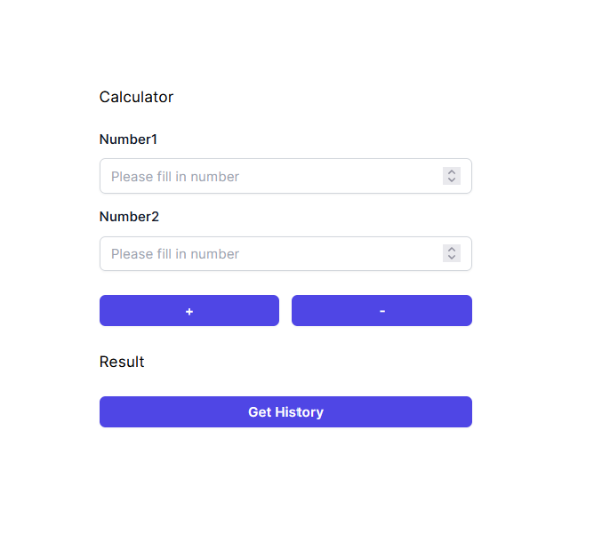

# compulsoryAssignmentDevelopmentofLargeSystems

## Schema Architecture

renars pls do this part because you have the image of schema 


## Fault Isolation

### Fault Isolation Strategy: Polly Retry and Circuit Breaker Policies

In the development of our project,
ensuring robustness and fault tolerance is paramount. To achieve this,
we have implemented fault isolation strategies using Polly's Retry and Circuit Breaker Policies.

#### Polly Retry Policy
The Retry Policy is employed to handle transient faults,
such as temporary network issues or service unavailability.
In our implementation, the Retry Policy is configured to make a maximum of
three attempts at an operation in case of failure. Each retry attempt is logged,
providing visibility into the retry behavior. This ensures that the system
can gracefully recover from transient failures without compromising reliability.

```
private static readonly RetryPolicy retryPolicy = Policy
.Handle<Exception>()
.Retry(3, onRetry: (exception, retryCount) =>
{
Log.Warning($"Attempt {retryCount}: Retrying due to {exception.Message}");
});
```

#### Polly Circuit Breaker Policy

The Circuit Breaker Policy is employed to prevent cascading failures and conserve resources in the event of prolonged or repeated failures. When the Circuit Breaker Policy detects a specified number of consecutive failures within a defined time window, it 'opens' the circuit, temporarily halting further attempts at the operation. This prevents the system from repeatedly attempting an operation that is likely to fail, thereby reducing load on dependent services and preventing service degradation.

In our implementation, the Circuit Breaker Policy is set to break the circuit after two consecutive failures within a one-minute window. Upon circuit breakage, a warning message is logged, indicating the reason for the circuit break and the duration for which it will remain open. Once the circuit has been opened for the specified duration, it is automatically reset, allowing subsequent attempts at the operation to proceed.
```
private static readonly CircuitBreakerPolicy circuitBreakerPolicy = Policy
    .Handle<Exception>()
    .CircuitBreaker(2, TimeSpan.FromMinutes(1), 
        onBreak: (exception, breakDelay) =>
        {
            Log.Warning($"Circuit broken due to {exception.Message}, circuit open for {breakDelay.TotalSeconds}s");
        },
        onReset: () =>
        {
            Log.Information("Circuit reset.");
        });
```

## Monitoring and Tracing with Serilog and OpenTelemetry (Zipkin) 

In our project,ensuring effective monitoring and tracing capabilities is
essential for maintaining system health and diagnosing issues.
To achieve this, we have integrated Serilog for
structured logging and OpenTelemetry with Zipkin for distributed tracing.

### Serilog for Structured Logging
Serilog enable us to capture rich log data in a structured format. With Serilog, 
we can easily configure log sinks to route log events to various destinations, 
including Seq for centralized log storage and analysis.

```
Log.Logger = new LoggerConfiguration()
    .MinimumLevel.Debug()
    .WriteTo.Seq("http://seq:5341") 
    .CreateLogger();
```
In the above configuration, we specify Seq as a log sink, allowing us to aggregate and 
analyze log data centrally for monitoring and troubleshooting purposes.

### OpenTelemetry with Zipkin for Distributed Tracing

we integrate OpenTelemetry into our project and leverage the Zipkin exporter, 
so we can generate distributed traces that span multiple services and components,
providing visibility into 
the flow of requests and identifying performance bottlenecks or errors.

```
builder.Services.AddOpenTelemetry()
    .ConfigureResource(builder => builder.AddService("AdditionService"))
    .WithTracing(builder =>
        {
            builder
                .AddZipkinExporter(options =>
                    options.Endpoint = new Uri("http://zipkin:9411/api/v2/spans"))
                .AddSource("AdditionService.Addition")
                .SetSampler(new AlwaysOnSampler())
                .AddAspNetCoreInstrumentation()
                .AddConsoleExporter(); // Export traces to console for demonstration purposes
        }
    );
```
In the configuration above, 
we configure OpenTelemetry to export traces to a Zipkin server,
enabling us to visualize and analyze the
distributed trace data using Zipkin's user interface.
for each service contain an instance of ActivitySource
that create span which be include under one trace 


## Communication between Services using EasyNetQ and RabbitMQ

In our project, effective communication between services is essential for building a
resilient and scalable architecture. To facilitate communication, we have adopted EasyNetQ,
a simple, lightweight messaging library for .NET, and RabbitMQ, a robust message broker.

### Setting up RabbitMQ Docker Container

```
services:
rabbitmq:
image: rabbitmq:3.12-management
hostname: rabbitmq
environment:
RABBITMQ_DEFAULT_USER: user
RABBITMQ_DEFAULT_PASS: pass
ports:
- "5672:5672"
- "15672:15672"
healthcheck:
test: [ "CMD", "rabbitmqctl", "status" ]
interval: 30s
timeout: 10s
retries: 5
start_period: 10s
networks:
- myapp-network
```
This configuration sets up a RabbitMQ container with management plugins enabled, exposing ports 5672 (AMQP) and 15672 (management interface) for communication and monitoring purposes.

### Establishing Connection with EasyNetQ
In AdditionAPI service, at the Addition class, 
we initialize a connection to RabbitMQ using EasyNetQ:
```
private readonly IBus _bus;

public Addition()
{
    _bus = RabbitHutch.CreateBus("host=rabbitmq;virtualHost=/;username=user;password=pass", serviceRegister =>
        serviceRegister.Register<ISerializer>(_ => new SystemTextJsonSerializer()));
}
```
Additionally, we register the IBus singleton in the dependency injection container 
to facilitate communication across service instances:

```builder.Services.AddSingleton<IBus>(RabbitHutch.CreateBus("host=rabbitmq;virtualHost=/;username=user;password=pass"));```

### Publishing Messages
````
private void PublishOperationMessageQ(int number1, int number2, int result)
{
    var message = new OperationEntryMessage
    { 
        OperationType = "Addition",
        Operand1 = number1,
        Operand2 = number2,
        Result = result,
        TimeStamp = DateTime.UtcNow 
    };

    _ = _bus.PubSub.PublishAsync(message); 
    Log.Information("Hello Addition");
    Log.Information($" [x] Sent message: {JsonSerializer.Serialize(message)}");
    Console.WriteLine($" [x] Sent message: {JsonSerializer.Serialize(message)}");
}
````
### Consuming Messages

We have subscribers, such as the HistoryConsumer, 
that listen for messages on specific RabbitMQ queues and process them accordingly:

````
  protected override async Task ExecuteAsync(CancellationToken stoppingToken)
    {
        stoppingToken.ThrowIfCancellationRequested();

        await _bus.PubSub.SubscribeAsync<OperationEntryMessage>("Operation_Entries", HandleOperationEntry, stoppingToken);
    }
````
This consumer subscribes to the "Operation_Entries" queue, processes incoming messages, 
and delegates the handling logic to the appropriate service.


## Docker

### Docker Configuration for Project Deployment
 Docker plays a pivotal role in ensuring consistency, 
 portability, and scalability of our deployment process. 
 We've orchestrated our services using Docker Compose,
 defining each component and its configuration within a unified YAML file.

### Docker Compose Setup
Our Docker Compose file  orchestrates the deployment of various services 
required for our project:

* RabbitMQ: Message broker for inter-service communication.
* Seq Server: Centralized logging platform for aggregating and analyzing log data.
* Zipkin: Distributed tracing system for monitoring and troubleshooting service interactions.
* API Gateway: Entry point for external requests, routing them to appropriate microservices.
* History Service: Microservice responsible for recording operation history.
* Addition API: Microservice handling addition operations.
* Subtraction API: Microservice handling subtraction operations.
* Web Frontend: Frontend application providing user interface for interaction.
Service Configuration


Each service is configured with its specific requirements and dependencies:

* Environment variables are set to define runtime configurations such as environment type and URLs.
* Ports are mapped to expose service endpoints to the host system.
* Dependencies on other services are specified using depends_on.
* Networks are defined to ensure communication between services within the Docker network.


## UI

### Choosing the suitable tool for the calculator web-app
To accomplish a simple UI followed by simple logic we could choose from many different technologies. 
But eventually, we have decided to use Nextjs, cause it's an easy setup that supports Typescript, which helps with type safety,
and Tailwind that's used for styling

### How does the calculator work
The UI consists of two input fields, after filling in the values we can call different endpoints(services) by pressing the corresponding button(- or +).
By clicking the Get History button, the history endpoint is called, and all calculator history is returned

